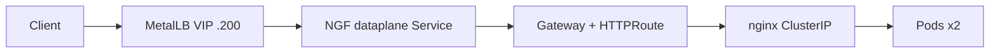

# Architecture

Primary slides:
- Platform / traffic / AuthZ: [`architecture.excalidraw`](architecture.excalidraw)
- High-level networking (Pod → Pod): [`networking.excalidraw`](networking.excalidraw)

Icons: [`excalidraw-libs/kubernetes-icons.excalidrawlib`](excalidraw-libs/kubernetes-icons.excalidrawlib) (Cursor Library via `.vscode/settings.json`)

Layout follows the Azure AKS-style reference: **left entry → blue dashed cluster → numbered namespace boxes → hex K8s icons**, solid arrows = traffic, dashed = ownership / certs.

| # | Area | Maps to |
| --- | --- | --- |
| **1** | Cluster | kubeadm + Calico (`eth1`) + `192.168.56.0/24` |
| **2** | `cert-manager` | Deployment / Pod / Service + `lab-ca-issuer` ClusterIssuer |
| **3** | `nginx-app` | Gateway + HTTPRoute → Service → Pods (+ `nginx-tls`, ConfigMap) |
| **4** | `nginx-gateway` | NGINX Gateway Fabric controller / dataplane + LoadBalancer Service → VIP `.200` |
| **5** | API AuthZ | `user` / `group` → RoleBinding / ClusterRoleBinding → Role / ClusterRole |

## Bring-up (ordered)

Full “done when” detail lives in the [root README](../README.md#bring-up-do-these-in-order). Sequence:

1. `make up` — VMs + kubeadm join  
2. `make admin` — platform + `nginx-app` RBAC + issue `nginx-deployer`  
3. `make deployer-context` — Mac kubectl as deployer  
4. `make app` — app manifests as deployer (refuses admin)  
5. `make browse` — `https://localhost:8443/` via SSH tunnel  

Recreate: `make destroy` then the one-liner in the README.

### Who owns what

| Who | Command / path | Owns |
| --- | --- | --- |
| Admin | `make admin` (`scripts/admin/`, `k8s/admin/`) | Calico, metrics-server, cert-manager + issuers, MetalLB, Gateway API / NGF, `nginx-app` NS + RoleBindings, CSR identity `nginx-deployer` |
| Deployer | `make app` (`scripts/nginx/`, `k8s/nginx/`) | Deployment, Service, ConfigMap, Certificate, Gateway, HTTPRoute inside `nginx-app` only |

## North–south traffic

**Client → MetalLB VIP `192.168.56.200` → NGF `Service` (LB) → Gateway / HTTPRoute → `nginx` ClusterIP → Pods**

Optional `make browse` = SSH `-L` (via worker1) → `https://localhost:8443/` → VIP:443.

**AuthZ (diagram panel 5):** CSR user `nginx-deployer` → RoleBinding + Role in `nginx-app` (and ClusterRoleBinding for GatewayClass/ClusterIssuer read). Optional OIDC: groups `oidc:platform-admins` | `oidc:namespace-devs` | `oidc:readonly-viewers` → bindings → roles.

Gatekeeper constraint manifests live under `k8s/oidc/policy/` but Gatekeeper itself is **not** installed by `make admin` — install separately before `make oidc-policy`.

## Networking

[`networking.excalidraw`](networking.excalidraw) — assignment view:

| Node | Role |
| --- | --- |
| controlplane `.101` | apiserver (+ OIDC flags), etcd · Calico on `eth1` · no nginx |
| worker1 `.102` | nginx Pod A |
| worker2 `.103` | nginx Pod B |

Pods talk across the host-only network via **Calico on `eth1`**. Client browse (VIP → Gateway → Service → Pod) is on the platform slide, not this one.
